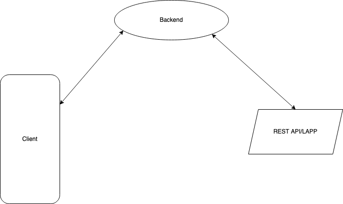
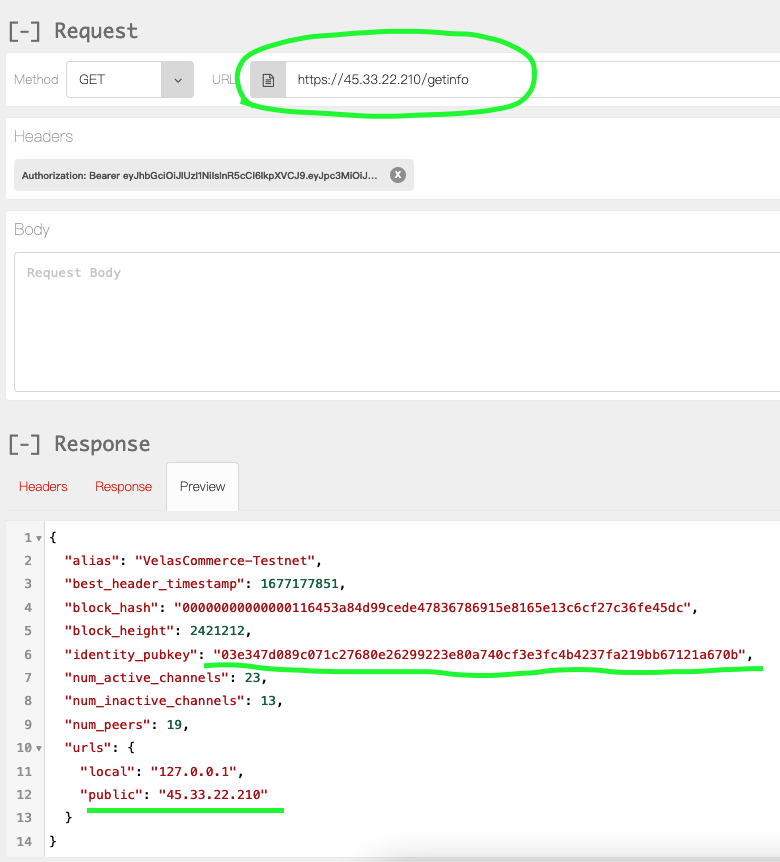
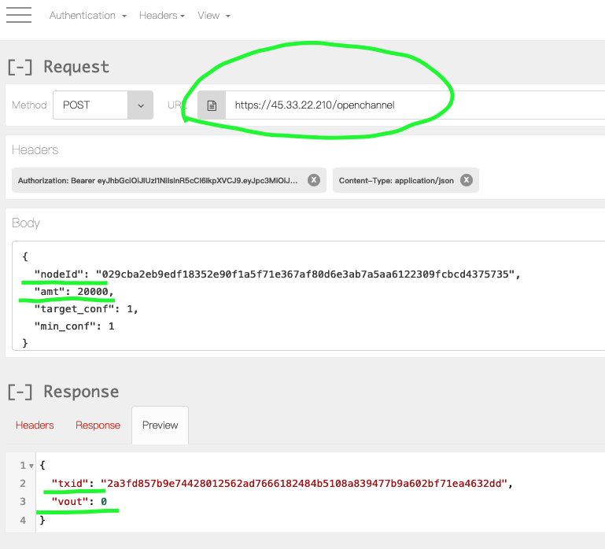
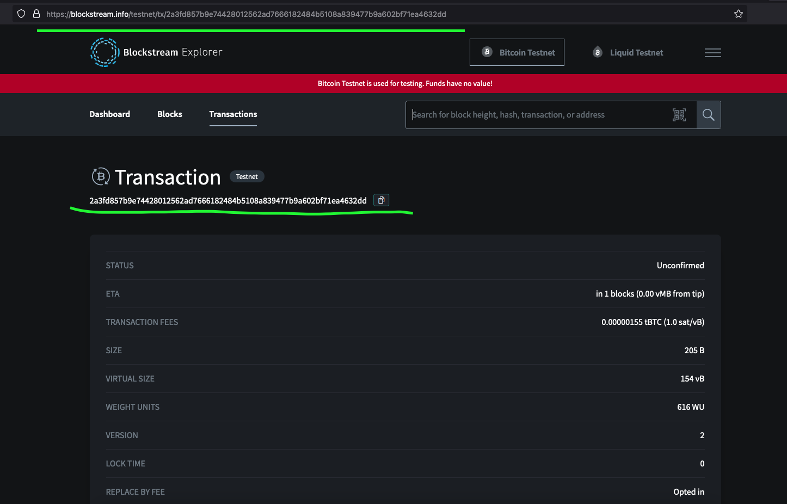
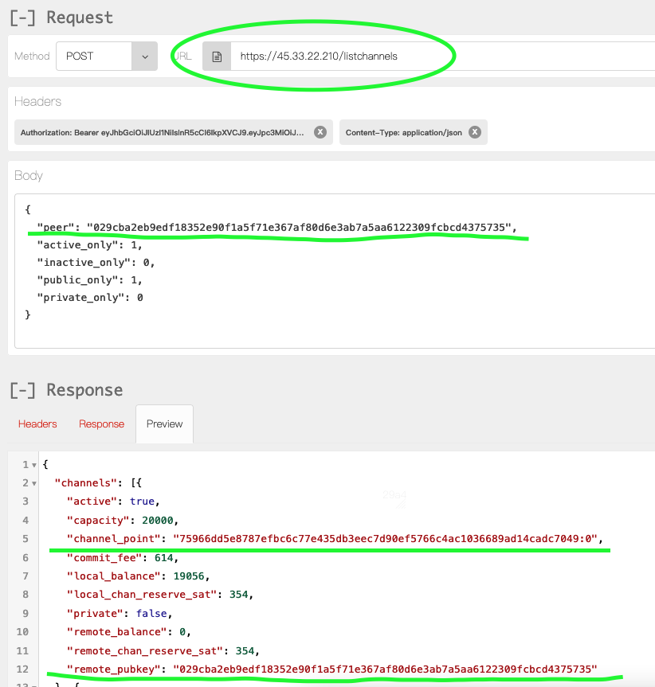
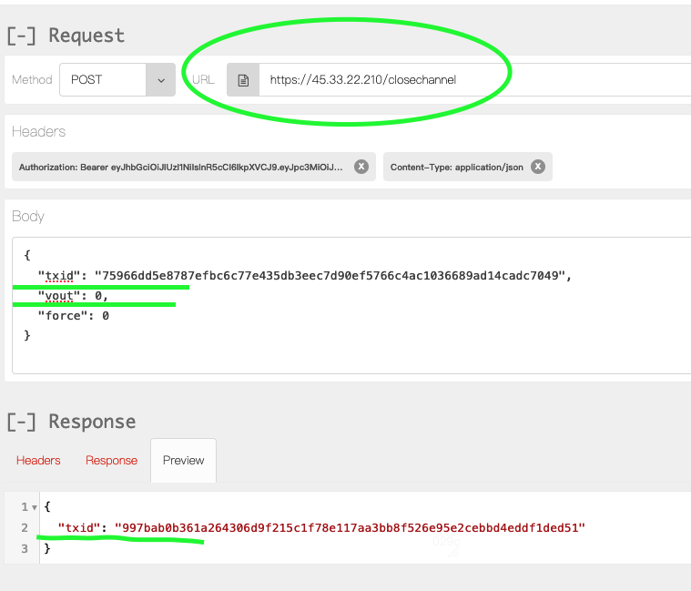
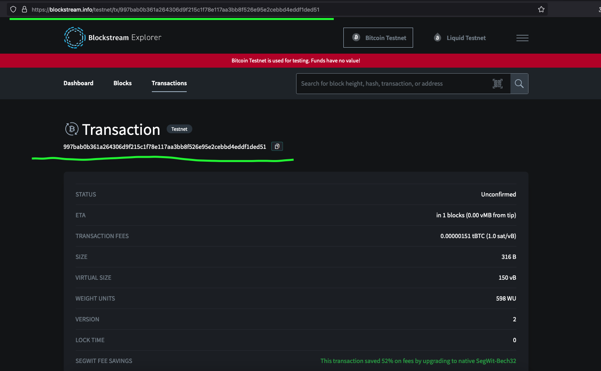
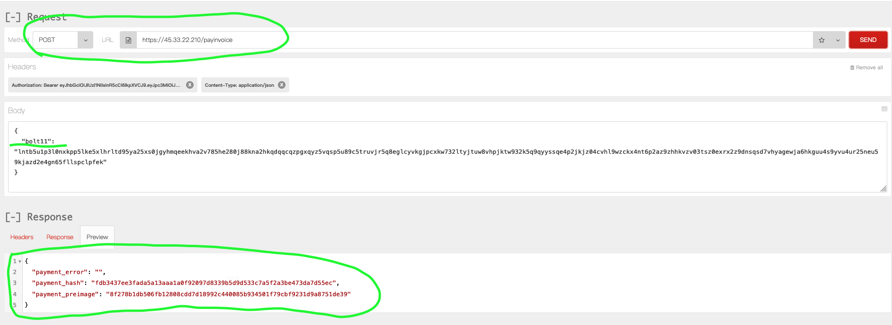

# Welcome to the VelasLightning Framework.  

A simple framework that cam be used to integrate lightning payment to your application in a none custodial way.

There are two pieces to this project.

1. A client library which uses the LDK ([Lightning Development Kit](https://lightningdevkit.org/)) and the BDK ([Bitcoin Development Kit](https://bitcoindevkit.org/)) to transform your mobile app into a light weight *lightning* node.
 
2. A REST API that communicates with a LAPP([Lightning Application](https://www.youtube.com/watch?v=8-CYfqVfa08)) to connect to peers, create channels, and process payments with a remote *full* *lightning* Node.
  - the LAPP is just a python application that communicates with the remote lighting node using [gRPC](https://www.youtube.com/watch?v=gnchfOojMk4)

# The Client library

the client library can be included in any swift project.  The VelasLightning Framework is packaged as an xcFramework.

the client library uses the LDK and BDK to turn you application into a lightweight lightning node.

included in the repo is an example project that shows how to include and use the client library into a iOS application. [Velas Lightning Example Project](https://github.com/diegovelascommerce/VelasLightning/tree/main/VelasLightningExample)

here are some videos demoing how the Velas Lightning Example Project works
- [demo paying an invoice](VelasLightningInvoiceDemo.mov)

- this project is for demo purposes *only*.  The client is directly communicating with the REST/LAPP interface which we do not recommend.  it's not a good idea to give people an idea on where your money is located.  Also there is some information that is returned from the LAPP that you may want to record and associate with your client's account information in the backend.  Such as the nodeId to their lighting wallet and channel_points to their channels.  Also the test server for the LAPP is using a self signed certificate.  Apple might reject apps that communicate with a backend that is not signed by a certified certificate authority like VeriSign, GoDaddy, etc.
  
- rather we recommend that all communication from the client to the LAPP is done through a proxy.  that way the actual location of the remote lighting is not as easily discernable and lightning critical information about the client can be recorded in the backend and associated with your clients.  Also you can just use the TLS/SSL certificate you have setup in your backend for encrypted communication between your app and backend.
- here is an illustration of the ideal way to have the client communicate with the REST API/LAPP

## [Velas Class](https://github.com/diegovelascommerce/VelasLightning/blob/main/VelasLightningFramework/VelasLightningFramework/Velas.swift):

the client will be interacting with the lighting network through a class called [Velas](https://github.com/diegovelascommerce/VelasLightning/blob/7cec361affe799d883b0ac9afa6ad4f93c2701ed/VelasLightningFramework/VelasLightningFramework/Velas.swift#L7).

this must be initialized and synced with the lighting network before you can begin to use it.
- [here is an example on how to do that](https://github.com/diegovelascommerce/VelasLightning/blob/7cec361affe799d883b0ac9afa6ad4f93c2701ed/VelasLightningExample/VelasLightningExample/AppDelegate.swift#L22)

Since starting up a lightning node does take sometime because the state of the channels, peers and transactions must be synced and verified,  it is recommended to initialize the Velas class in the same startup method as your application. For example, in the AppDelegate of an iOS project.

however, you can start the Velas Class anywhere you like just keep in mind that it take a while to sync and it would be a good idea to keep the instance of the Velas class as a global static variable, that way you only have to initialize it once during the lifetime of the application.  If you are using a dependency injection framework then try to keep the velas object in a statically scope object.  otherwise you will have to restart and resync the velas object each time before using it.

## Velas Class Methods:

### `init(network: Network = Network.testnet, mnemonic: String? = nil) throws`

this is the initializer for the Velas Class.  
  
a mnemonic is passed over to the BDK which creates the private/public keys for your wallet.  The private key is then passed to the LDK so that it can create a node associated with your key and sign transactions with that it.
  
- [here is an example of how to initialize the Velas Class in the appDelegate.](https://github.com/diegovelascommerce/VelasLightning/blob/9fe0f7e9275c5ffad363829773bd2bceb091cd3d/VelasLightningExample/VelasLightningExample/AppDelegate.swift#L22)
    - notice that the Velas object is saved to a global variable of the project.
you don't have to do it this way.  if you are using a dependency management framework you can setup it up as a static scoped object.

#### parameters:
*@network:* the blockchain network that you want the Velas object to work with.
  - by default it is set to testnet, which is just a testing network.  No real money is used.

*@mnemonic:* this is the mnemonic phrase used to create both the public and private keys for your bitcoin wallet.

- this should be saved on the users device. Also there needs to be a screen where the user can see this mnemonic and write it down somewhere so they they can recreate the public/private keys in another bitcoin wallet to reclaim their funds, incase they lose or their phone.

### `getNodeId() throws -> String`

this method returns the lightning network nodeId of the client.

- this information is important when making a request to the LAPP to create an outbound channel with your clients node. 
  
- this should be saved in the backend of your application and associated with the client account information. 
- if you want to see the channels associated with your client you will need this nodeId.

#### returns -> String:
 
- this is the nodeId of the lightweight Lightning Client that was created on the phone.

### `connectToPeer(nodeId: String, address: String, port: NSNumber) throws -> Bool`

this method connects the client to another lightning node.
  - before you can create channels and submit invoices with another lighting node you have to connect to it.
  - to make a connection you will need the nodeId, address, and port of the other lighting node you the client to connect to.

#### parameters:
@nodeId: nodeId of the node you want the client to connect with in the lighting network.

@address:  ip address of the remote node you want to connect to

@port: the port in which the remote node is setup to listen for peer requests

#### returns -> Bool : 
- returns true if connection was a successful, false if connection did not go through.

#### `listPeers() throws -> [String]`

lists the peers that client is connected to
- you need to be actively connected to a peer if you want to do anything in the lightning network

#### returns -> [String] 
- returns an array of strings representing peers that client is connected to.

### `listChannelsDict() throws -> [[String:Any]] `

list channels that client has setup.
- note:  the client does not have the ability to create outbound channels yet.  Since, the client has no liquidity/funds when they first start they can not create a channel.  It can only request that the LAPP create an outbound channel with it.

#### returns -> [[String:Any]]
- returns an array of dictionaries that have information on each channel that you have setup.

### `createInvoice(amtMsat: Int, description: String) throws -> String`

this creates an bolt11 invoice that you will need to submit to the REST/LAPP in order to receive rewards
- a bolt11 looks something like this: 
    lnbc2500u1pvjluezpp5qqqsyqcyq5rqwzqfqqqsyqcyq5rqwzqfqqqsyqcyq5rqwzqfqypqdq5xysxxatsyp3k7enxv4jsxqzpuaztrnwngzn3kdzw5hydlzf03qdgm2hdq27cqv3agm2awhz5se903vruatfhq77w3ls4evs3ch9zw97j25emudupq63nyw24cg27h2rspfj9srp
 
#### parameters:
  
@amtMsat:  amount you want to be paid in milisatoshis(1000 of a a satoshi)

@description: a description you would like to attach to this invoice.

#### returns -> String
- returns the bolt11 string

### `closeChannelsCooperatively() throws`

- this allows you to close all the channels cooperatively, this mean you were able to negotiate with the other peer you are connected with and you can both get your share of the channel near instantly.

### `closeChannelsForcefully() throws`

- this allows you to close all your channels forcefully, this usually is because the other peer was not online to negotiate when to close the channel.
- this is usual considered the bad way to close a channel because sometimes you have to wait 2016 block on the blockchain before you can get your money.

# REST API / LAPP

this handles the creation of channels and the processing of invoices through a REST/LAPP interface.

It is recommended that all calls to the REST/LAPP interface be done through a proxy.
that way the location of the lightning node will not be obvious but also make scaling  easier in the future.

here is an example of how the REST API / LAPP can be setup.

  
The backend is written in python using [Flask](https://flask.palletsprojects.com/en/2.2.x/).

It communicates with a LAPP which communicates with a remote full lighting node using [gRPC](https://grpc.io/).

for security reasons, all requests are encoded using [TLS](https://flask.palletsprojects.com/en/2.2.x/).

also for security reason, all request must have to have a JWT([Json Web Token](https://www.youtube.com/watch?v=7ozQLeFJpqs)) token in the header of the request.

we have a test server setup for experimenting with the REST/LAPP APIs.
- the server is called velastestnet and it's ip address is 45.33.22.210 
- it uses a self signed certificate for TLS.
  - however, in production it is recomended that the client communicate with a backend that  is signed with  a public certification authority like VeriSign, Digicert, etc.
  otherwise the app might be rejected by apple.

- for testing purposes the JWT token used for communicating with velastestnet(45.33.22.210) was created usings the secret phrase, literally, 'secret'.
  in production it will be expected that the jwt will be created with a much more secure secret phrase.

included in this project is an export file for a plugin called [RESTClient](https://addons.mozilla.org/en-US/firefox/addon/restclient/).
  - you can download the plugin for both Firefox or Chrome. 
  - note: we have tested these endpoints on many different machines.  the ones you want to focus on is https://45.33.22.210, the velastestnet server

also we have some unit test that can be useful in showing how the api can work.  it uses [pytest](https://docs.pytest.org/en/7.2.x/).
- [unit test](https://github.com/diegovelascommerce/VelasLightning/tree/main/VelasLightningAPI/tests)
  
## `GET: getinfo`

you call this endpoint to get the information of the remote Lighting node that the LAPP is connected to.

you will need to extract information such as the identity_pubkey and the public ip address of the node so that the client can create a connection with that node

### response:

@identity_pubkey: is the node ID of the remote Lightning node that the LAPP is setup with.
- the client will need this information in order to connect to the remote full lighting node.
  
@urls.public:  this the public ip address to the remote Lighting node that the LAPP is setup with.
- the client will also need this information in order to connect the remote full lighting node.

## `POST: openchannel`

this is responsible for creating a channel between the client and the LAPP backend.

### body:

@nodeId:  node ID of the client which the LAPP will setup a channel with it's backend lightning node.
- this is the node ID of the client that is running VelasLighting Framework.  Not to be confused with the node ID of the remote Lighting node that the LAPP communicates with.

@amt:  the capacity that you want the channel to be.
- this is specified in satoshis.  

### response:
@txid:  this is the id of the transaction that was used to fund the channel.
- this can be seen in a block explorer.
  - here I am using [blockstream.info](https://blockstream.info/testnet/)
  

@vout: is the index of where the transactions in places in the block.
- you will need both the txid and the vout in order to close the channel in the future.
- it is a good idea to save this somewhere like in a table that is associated with your client's account information.

## `POST: listchannels`

returns a list of channels that the remote Full lightning node has setup.

### body:
@peer:  the node ID which you want to see channels for.
- if you leave this blank it will return to you all the channels you have setup in your remote full lightning node

### response:
@channel_point: this is a combination of the txid and the vout.
- you will need to provide this information if you want to close the channel in the future.

### `POST: closechannel`

this is used to close a channel

- you would probably use this to close the channels on behalf of a client, in case they lost their phone.

### body:
@txid:  the id of the transaction that was used to fund this channel
@vout:  the index in the block that the funding transaction was added to.

### response:
@txid:  the id of the transaction that give participants back their money
- you can see this transaction on a block explorer.  
  

## `POST: payinvoice`

this is used to pay an invoice that the client generated.
- example: client reached their goal and generated a bolt11 using `velas.createInvoice`
- the bolt11 gets processed by the lapp and now the user balance reflects that.

### body:
@bolt11: this is the bolt11 string that was generated by the client.

### response:
@payment_error:  if there were any errors, this field would have a message explaining the problem

@payment_hash:  this is a hash that is used in [HTLC](https://www.youtube.com/watch?v=NcKNzk-H8CY).

@payment_preimage:  this is the preimage that generated the HASH for the [HTLC](https://www.youtube.com/watch?v=NcKNzk-H8CY).
- if the payment was successful this field should be filled