# Welcome to Bruno

This a bruno, it is like postman but does not require an account and you can do some scripting for responses from the API.

LNBits is a layer on top of the Lightning network. it allows a Lightning Node to have multiple wallets but they all use the same channel funds.

It is LNBits that keeps track of what part of the funds belong to which wallet.

## velastestnet LNBits

these are the APIs for LNBits setup on the velastestnet(45.33.22.210) server.

in order to use these APIs you need to setup an environment in bruno,
which provides the credentials you need to use the APIs.

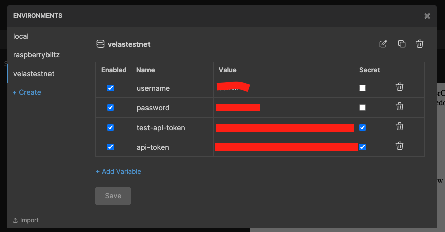

for the majority of the API call you will just need the `api-token`,
which is associated with a account that has access to the API.  
this value will be used in header of most requests

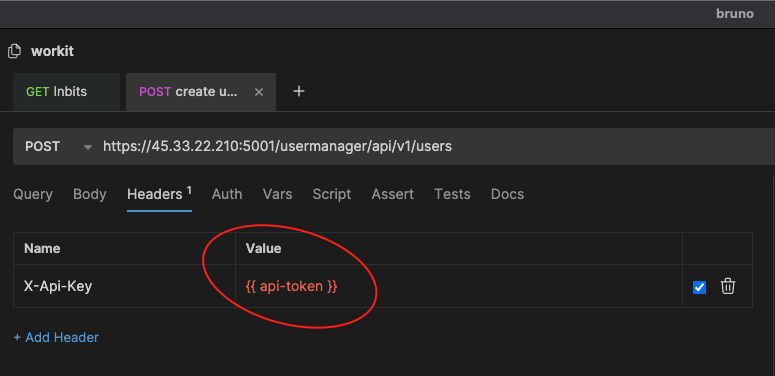

### 1. Create User

this is the api call for creating a new user with a wallet.

- you must use the `apikey` of the super user

`POST: https://45.33.22.210:5001/usermanager/api/v1/users`

you can specify the user and the wallet you want to create for the user through
the body.

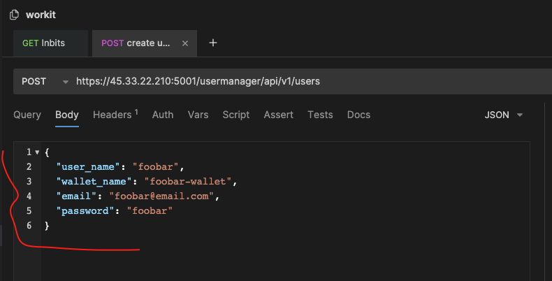

a new user with a wallet and apikeys is created

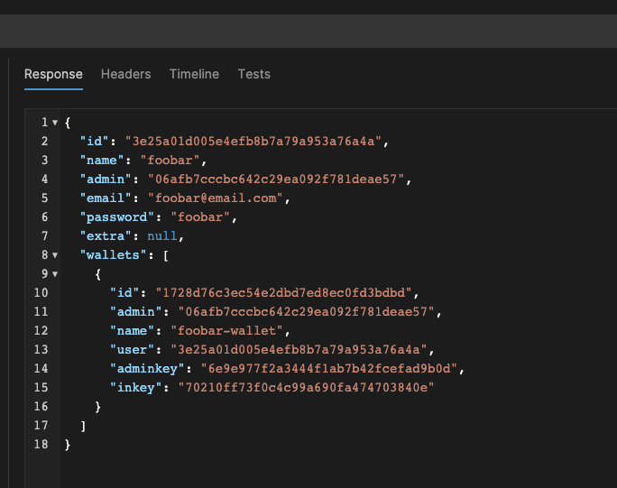

- you can use the `apikey` to do transactions with the newly created wallet

### 2. Get users

this is an api call that gets all the users that were created.

- you must use the `apikey` of the super user.

`GET: https://45.33.22.210:5001/usermanager/api/v1/users`

it returns all the users who were created with the super user.

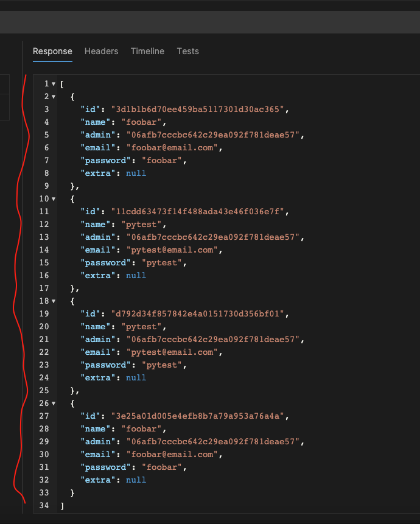

### 3. Get wallet for user

if you want to findout what the balance is for a users wallet you would use this API.

`GET: https://45.33.22.210:5001/api/v1/wallet`

you must pass in the `apikey` that is associated with the wallet you want to query.

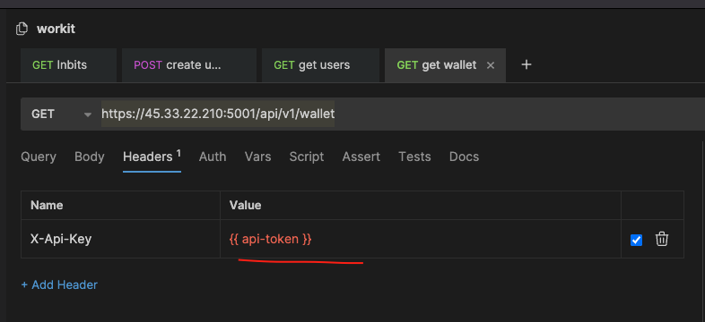

it will return the name of the wallet associated the the key and the balance.

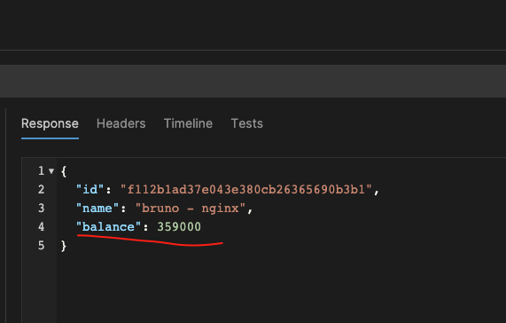

### 4. TOPUP

this is the main way how you will assign awards to a user.

TOPUP just gets funds from the lightning node and assigns them to a wallet,
without having to use the lightning network.

`PUT https://45.33.22.210:5001/admin/api/v1/topup/?usr=<super-user-id>`

- super-user-id: the ID of the super user who has access to the funds of the Lightning Node.

you have to specify the id of the wallet that you want to assign funds to
and the amount of funds you want to assign it.

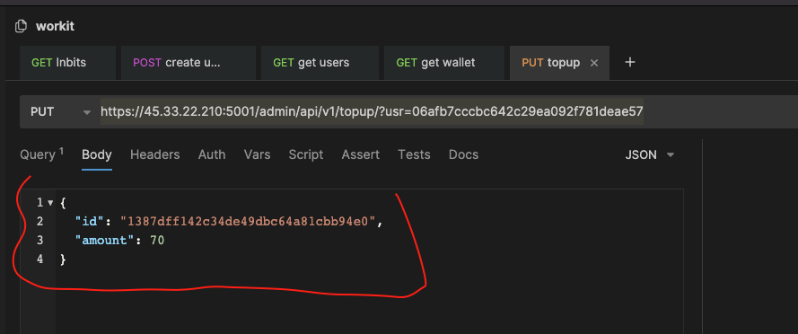

you should get the following response, if successful.

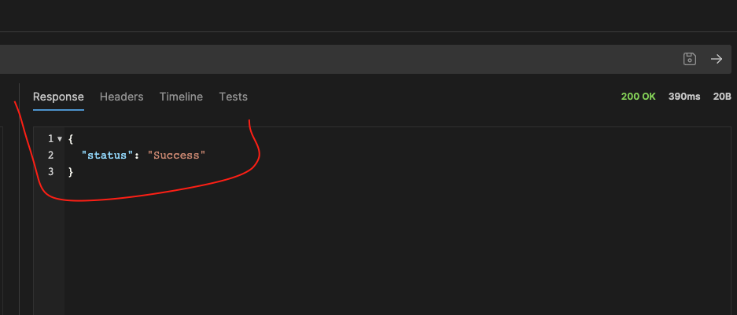

### 5. PAY INVOICE

when you want to pay an invoice with a user wallet you just created.

`POST: https://45.33.22.210:5001/api/v1/payments`

you specify the bolt11 you want to pay here

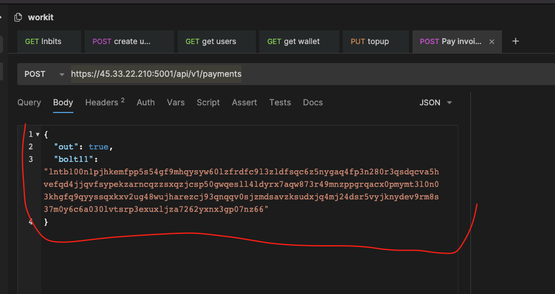

you specify the `apikey` of the wallet you want to pay the invoice with in the header.

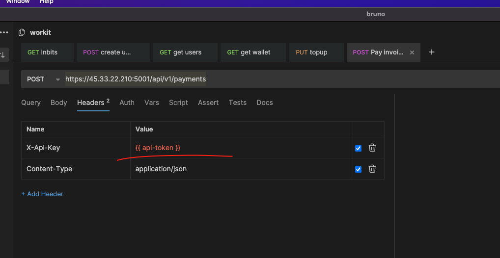

you should get a resp˜nse like this.˜

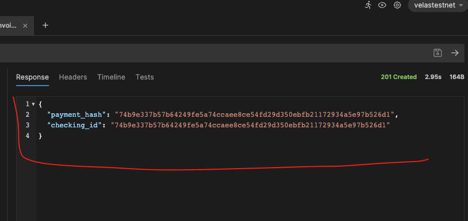

### 6. Create Invoice

when you want to create an invoice for a wallet you created.

`POST: https://45.33.22.210:5001/api/v1/payments` .

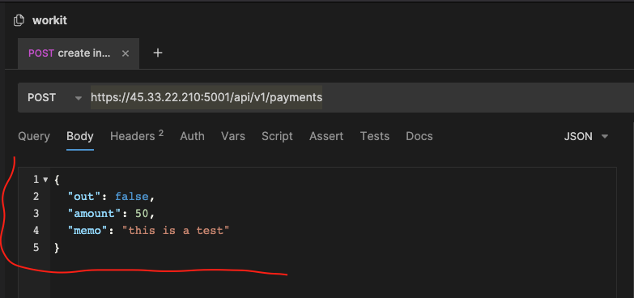

- in the body specify both the amount and a memo.

you need to specify the apikey of the wallet you want to create an invoice for.

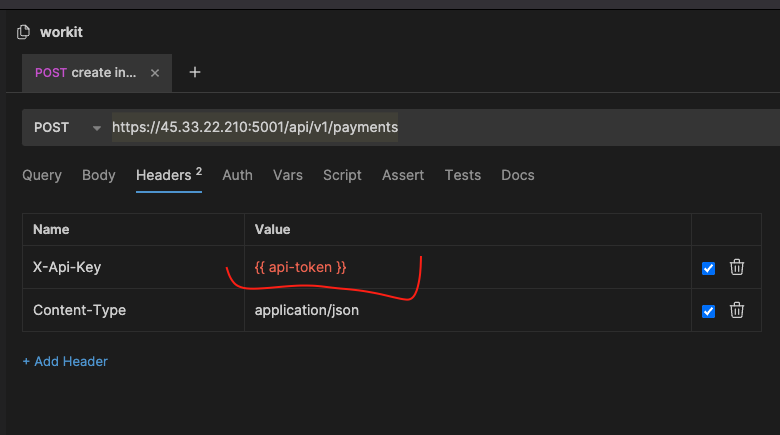

the response will return a bolt11 for that wallet

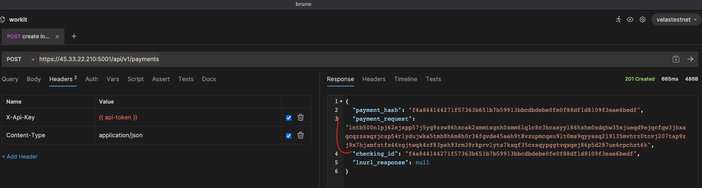

### 7. List payment for wallet

this will list all payments and deposits for a user wallet.

`GET: https://45.33.22.210:5001/api/v1/payments`

you must use the `apikey` for the wallet you want to inquiery

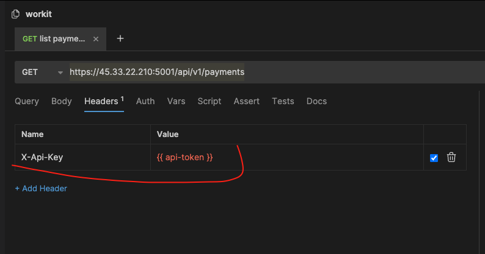

the response is the list payment and deposit for the wallet

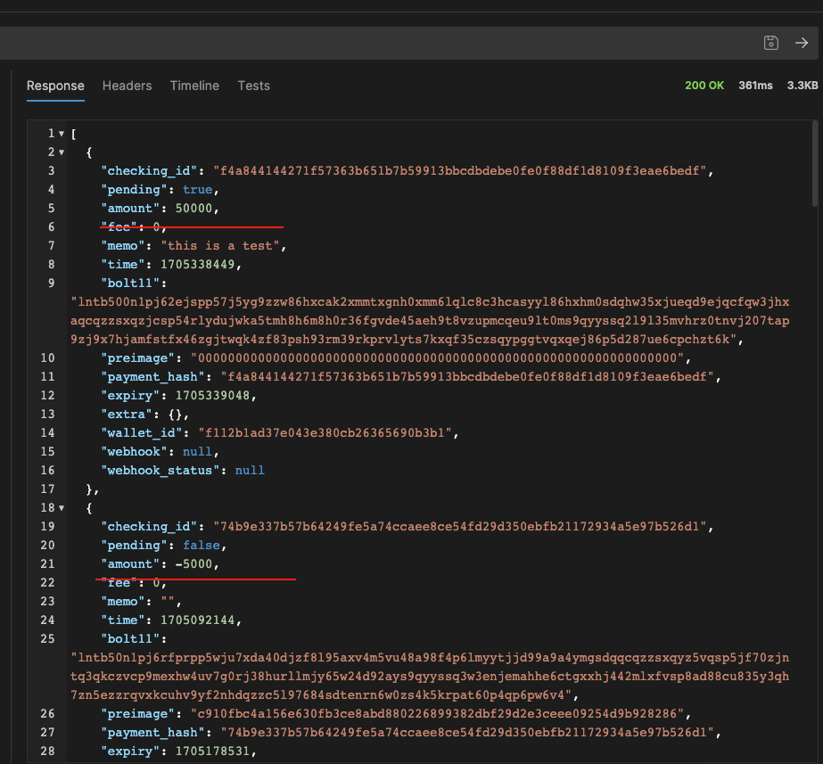

### 8. check invoice

if you want to check the status of an invoice use this api point.

`GET: https://45.33.22.210:5001/api/v1/payments/<payment_hash>`

- payment hash is the hash that is returned when you create a bolt11.

here is what the response should look like

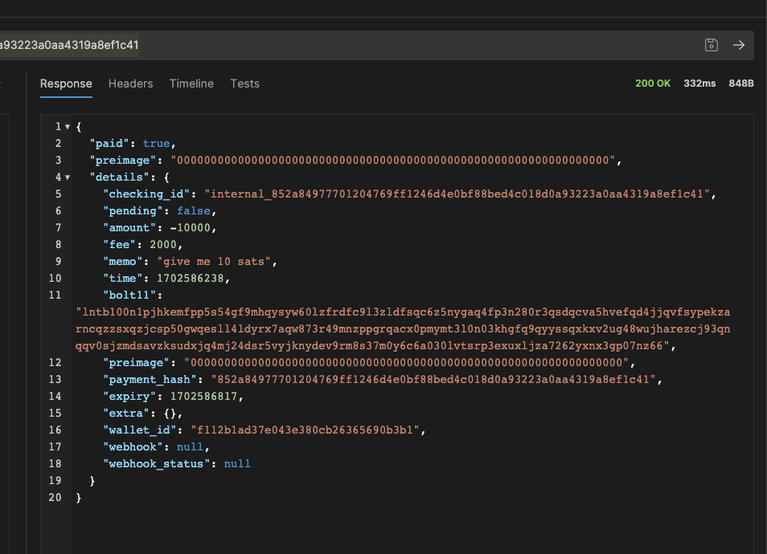

### 9. decode invoice

if you want to decode an invoice use this endpoint

`POST: https://45.33.22.210:5001/api/v1/payments/decode`

in the body you specify the bolt11 you want to decode.

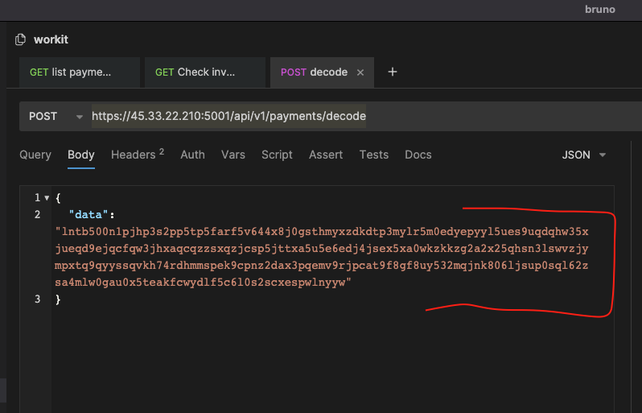

the response should be something like this.

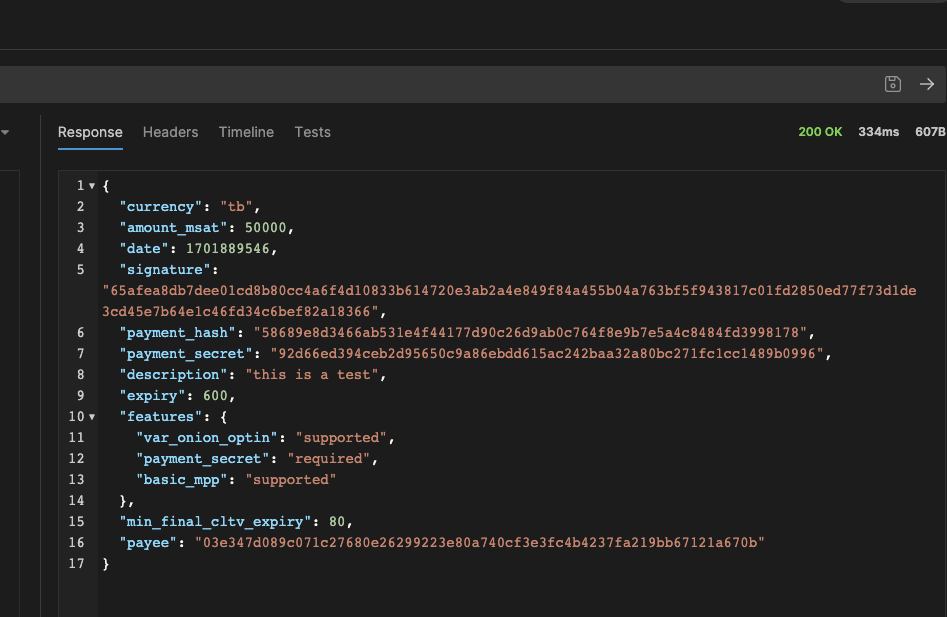
